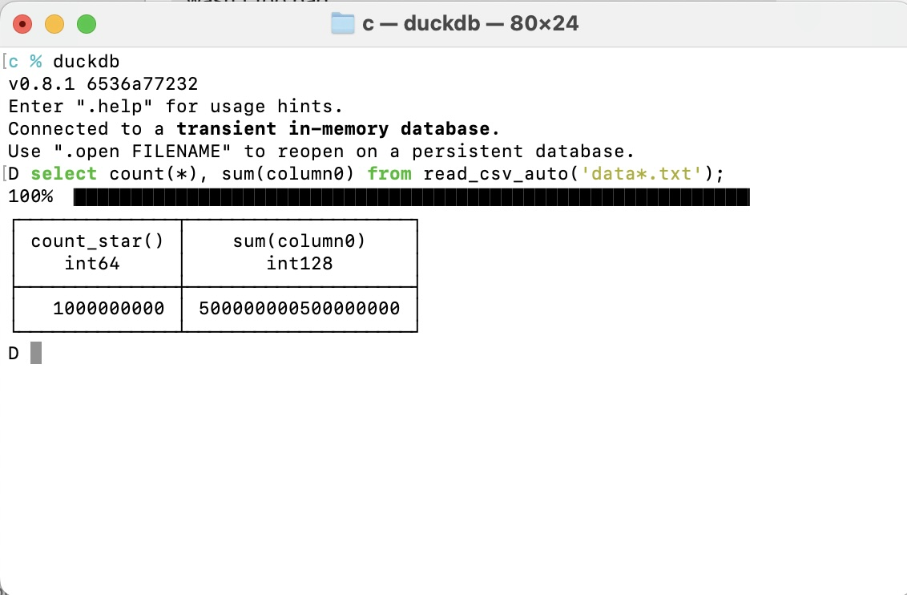

### Write 1B integers to text files under 3 seconds
#### Author: Matt Martin
#### Date: 5/6/24

---
#### Overview
I've been on a crusade lately to figure out the absolute fastest way to write 1B integer rows across multiple text files in parallel. I think I finally have a well rounded set of test code to share. I settled on building the program in C, Rust, and Go. Below are my explanations for each:

- Why C? Because it's the OG of programming languages. I've been told by many seasoned and wise dev's that if you know how to "actually" program in C, you will do well. As of this writing, I'd classify my C skills as a softmore in High School. I occasionally still hit segmentation faults. I might get to senior level one day.

- Why Rust? Because Rust is quickly positioning itself as the Data Engineering (DE) programming language of the future. It's fast, it's "safe", and it hurts your head to learn how to code in it. It really brings the best...or sometimes worst out of your skills.

- Why Go? Because Go is awesome and fun to program in. Because Go makes the concurrency model a first class citizen with go routines. Because with Go, it's quick to learn, and I don't fight with the compiler like I do with Rust. Because the gopher mascot is just awesome.

---
#### The Hardware
I built and ran each program on my Macbook Pro M2 base model. It has 16GB of ram and 12 cores.

---
#### C Code Deep Dive
The C code can be found [here](./c_par/c_parallel_int.c). It uses the standard ```fork()``` to execute in parallel. This code is very VERY involved. It has a lot of pointers and buffers and is not for the faint of heart. When I first started experimenting with C code for this exercise, I used the nifty ```sprintf``` function from the C standard lib, which can convert integers to strings (which is what we need to pop integers into a human readable text file). However, ```sprintf``` can do a whole lot more than just convert integers. It was built to convert a multitude of things such as bytes, structs, arrays, floats, and other stuff. Because of this, once you scale this process to try and crunch 100M+ rows, you will start to see a degredation on performance. Thus, at the suggestion of Thomas Kejser on LinkedIn, I instead decided to boot strap an algorithm that was invented by Terje Mathisen back in 1991. It's purpose is to convert integers to strings (in ascii/hex byte format) as fast as possible. It does not do anything else besides that. More on that function can be found on this thorough [Stack Overflow article](https://stackoverflow.com/questions/7890194/optimized-itoa-function).In laymen's terms, what the Terje algorithm does is split the integer into 2 halves, computes both halve's ascii/hex representation, then sandwiches the values back together and Voila!. The functions in the C code that execute this magic are "itoa_terje_nopad" and "itoa_terje_impl". The latter creates a padded version of the integer with leading zeroes when needed. One might ask why? It's because when you are dealing with integers, you can have a max of 10 full digits. For a signed integer (32 bits), you can go as high as 2,147,483,647. For an unsigned integer, that number is doubled, but still you are at a total of 10 digits. The "itoa_terje_nopad" strips off the leading zeroes for our exercise. Could these be combined? Probably, but I'm not going to try and solve that Rubik's cube today.

---
#### Go Code Deep Dive
For the Go code, which can be found [here](./go_par/), I leveraged go routines to execute the write process in parallel. Additionally, the standard built-in ```strconv``` library for Go is very fast to convert integers to strings when using the ```AppendInt``` function. And even more interesting, if you actually look at the source Go code for ```strconv```, which can be found [here](https://github.com/golang/go/blob/master/src/strconv/itoa.go), you will notice that it's doing something similar to what the Terje method in C is doing (look at private function formatBits). Coincidence...I think not :).

---
#### Rust Code Deep Dive
The rust code can be found [here](./rust_par/src/). Rust was a very interesting beast. I did nearly zero optimization on the code, and it still was whicked fast. The built-in rust macro ```writeln!``` seems to not struggle at all when you scale the amount of rows you want to write. From what I've read, Rust macros are special in that they will do compile time optimizations vs. a user funtion (fn) that relies on runtime optimization. I used the Rayon crate to handle the parallel processing.

---
#### Compiling the binaries
Just to make sure the users don't think I performed some type of voodoo on the programs, below are the commands I used in mac terminal to compile each binary:

#### Rust
```bash
cargo build --release
```

#### Go
```bash
go build -o gpw
```

#### C
```bash
clang c_parallel_int.c -o cpw
```

---
#### Results
All three programs write 1B rows across 20 files. I ran each program 5 times and logged the fastest run time. Below are the results:

| Language | Fastest Time |
| -------- | ------------ |
| C        | 2.63 seconds |
| Rust     | 2.94 seconds |
| Go       | 3.09 seconds |

And finally, all is good and all is sane in this world. The C code was the fastest (as expected) :) with Rust in a close second. Go performed exceptionally well, given that it also has a Garbage Collector (GC), which C and Rust do not.

---
#### Validation
You might be curious how I validated that 1B rows were actually written? It was a combo of a few things I did:

1. Used the terminal built-in head and tail commands to sample the files to see where rows started and ended. On the last file for instance, I ran this tail command to see the last 5 rows written:
```bash
tail -n 5 data19.txt
```

2. I used DuckDB to count the number of rows and also sum the values. The counting validates 1B entries, whereas summing them ties into another nifty formula I learned recently for arithmetic series. If you are just looping from numbers 1 through N and accumulating the value of the loope iterator up, the formula is:

```bash
res = (n * (n+1)) / 2
```

Since we are targeting 1B rows, that formula should result in: 
(1B * (1B + 1))/2 = 500,000,000,500,000,000

Using that in DuckDB looks like this:



---
#### Conclusion
Writing these test harnesses really made me appreciate how far we have come with modern languages like Go and Rust. As evident with C, if you want killer performance, you have to roll your own custom function. And given how low level C is, where you have to manipulate buffers, keep track of the buffer position, etc, it can become overwhelming. I was very pleased that Go was nearly as fast as Rust and C, given it has a GC.

---
#### Other Thoughts
C is an amazing language, but I don't see it as my daily driver for coding. I will continue to stick with Rust and Go for that.
