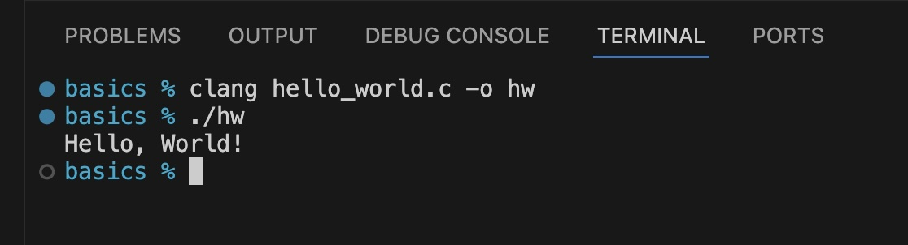

### C Tutorial For Data Engineers
#### Author: Matt Martin
#### Last Updated: 5/8/24

---
### Overview

C is the foundational programming language that runs pretty much everything in the world from databases to applications like Microsoft Excel and operating systems. It is a very low level programming language that allows developers to directly manipulate memory on the machine...it doesn't get much faster than that. Many higher level languages depend on C to compile and run. Go Lang uses C libraries for garbage collection. Rust uses C libraries for compilation. Python uses C for its runtime. With all that said, in my personal opinion, I think it's important for data engineers to have a basic understanding of the C programming language. I'm not saying you should start writing pipelines in it, but by having a general understanding of how it works, it will help appreciate how far we have come with our more modern langauges.

For data engineers, I will cover the following topics in C:

1. Creating a simple hello world
2. Working with Strings
3. Working with Integers
4. Reading Files
5. Writing Files

At that point, that is pretty much all you really need to know about C for data engineering. I would not reach for C for any DE task in today's landscape. Below is my current decision logic on the programming language to use for data pipelines.

- Default to Python unless speed becomes a problem
- If Python is not cutting, go with Rust

That's pretty much it. So let's dive in.

### Hello World in C

To get your fist C program running, its really quite simple. Crack open notepad or VS code and create a file called "hello_world.c". In that file, add the following contents:

```C
#include <stdio.h>

int main() {
    printf("Hello, World!\n");
    return 0;
}
```

What this code is doing is it is importing the standard IO library from C <stdio.h> and using that to print to the console "Hello World". The ```\n``` at the end signfies a new line after the print statement.

Next, we need to compile the code. To do this, you have some options. You can download the GCC compiler if on Windows or you can download the Clang compiler if on mac. I'm on a mac and used homebrew to install clang, which is part of the Apple xtools suite. Once Clang was installed, to compile the file, we run this in terminal:

```bash
clang hello_world.c -o hw
```

What this does is creates a binary executable file called "hw". Next, to run this file in terminal, we run this command:

```bash
./hw
```

What you should see in terminal is "Hello World!". Here's a photo of what it should look like:



Congrats, you have now written a C program and can tack that on your resume.

---

### Strings in C
Now that we have written a basic C program, let's look at how we can manipulate strings in C. To do this, there are numerous methods. I will be covering 3 of the most common ones I know. But before we get to the code, there is some important info you need to know about strings in C. The String data type does not exist! Instead, you have a single character ```char``` data type. So then...how do we actually create a string? A string is just an array of chars! And that is literally how it is treated by all other programming languages. When you create a "string" in C#, python, or Rust, under the hood, it's really just an array of chars. 

