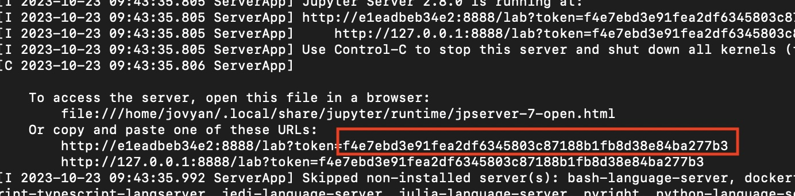
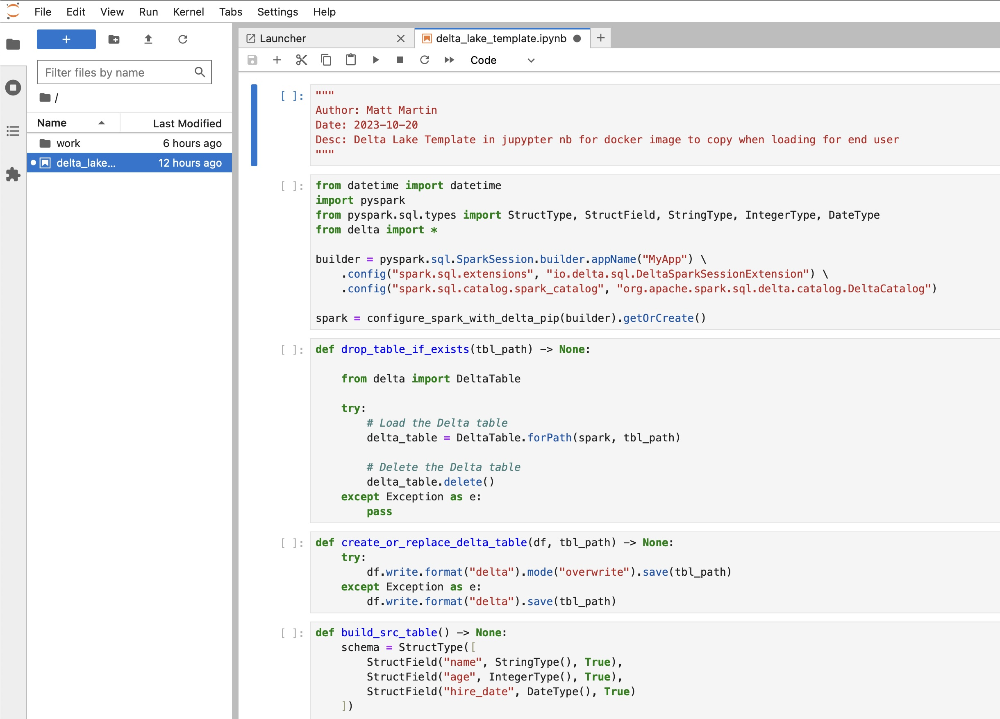

### Using Docker with Delta Lake

<h5>Author: Matt Martin</h5>
<h5>Date: 2023-10-20</h5>

<h4>Overview</h4>
Delta Lake is a great platform for running ANSI SQL statements against open source files. Instead of having to load your data into a database, you can just store the files in an object store. This makes portability easy between cloud platforms. To get Delta Lake to work though, you have to be very specific on the versions of spark/hadoop/java/scala that you have installed on your machine; otherwise, you will get very obscure and bizarre runtime errors. The easiest way to make this process repeatable is by leveraging a docker file, like the one in this repo.
<hr></hr>
<h5>Install Steps</h5>
The docker file pulls in the correct versions of spark and other dependencies to where we can in one container launch a python notebook that has all the requirements we need. To do this, follow these steps:
<h5><h5>
1. Fork this repo to your local workstation (you will need more than just the docker file as the docker file copies and uses a few other files in this repo to finalize)
2. Build the image on the docker file using docker desktop or the vs code docker plugin
3. Run a container off of the image. You can use a command like this:

```bash
docker run --name test_dl_instance -p 10000:8888 dl1
```

4. Open a web browser and goto "localhost:10000"
5. You will be prompted for a password; when you launched the container, towards the bottom you will see a section where it tells you the token for the notebook. That is your password. Here's a screenshot showing it



6. Once you have put in the token, jupyter lab should launch and you should see a template notebook with some sample delta lake spark code pre-loaded that you can experiment with.




<h4>Matt's Side Notes</h4>
1. My IDE of choice is usually VS code. So, if you don't like having to go into the web browswer and use the jupyter lab UI, you can in VS code plug directly into the container and edit there. To do that, in VS code, download the docker extension. Once its up and running, you will be able to navigate to your container and the sample notebook that was pre-loaded. From there, VS code will ask you for the host URL and you simply put in "https://localhost:10000/lab". It will then prompt you for the password, which again is the token that was called out in step 5 above. Once you have put in that info, you will then be hooked directly into the containers spark runtime.
2. Friendly reminder that once you destroy a container, all the work you did is gone. To mitigate this, you might want to look into Docker shared volumes, which allows the container to share files outside its walls and onto your local system.