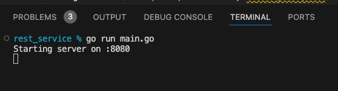

### Simple Web Request Service in Go Lang
#### Author: Matt Martin
#### Last Updated: 5/12/24

---
### Overview

You ever wonder when you write a data pipeline that pings a REST api service how it all works? Like fetching tracking info for a UPS package or getting weather information for a particular zip code? What's on the other end that receives your URL and sends back the payload? How does it "JSONify" it? How is it always on and ready to serve?

Well if you are interested, then keep reading this article. It provides a simple demonstration of making a RESTful API service that can receive a few different URL paths (known as routes) and serve back a response. And for fun, we will be serving back Chuck Norris jokes :smiley:

--- 
### Creating the Rest API Service

Creating a Rest API service in Go is pretty straight forward. You can use Go's `net/http` package as seen below. In the example below, we are creating 3 different routes:

1. The Default path (localhost:8080/)
2. Joke Path to live API hit (localhost:8080/getjokeapi)
3. Joke Path to postgres DB (localhost:8080/getjokedb)

Once those routes are established, we simply launch the server and listen e.g. `http.ListenAndServe`.

```Go
package app

import (
	"encoding/json"
	"fmt"
	"net/http"
)

type Message struct {
	Joke   string `json:"joke"`
	Source string `json:"source"`
}

func LaunchRestServer() {

	http.HandleFunc("/", func(w http.ResponseWriter, r *http.Request) {
		handleHome(w, r)
	})

	http.HandleFunc("/getjokeapi", func(w http.ResponseWriter, r *http.Request) {
		handleJokeApi(w, r)
	})

	http.HandleFunc("/getjokedb", func(w http.ResponseWriter, r *http.Request) {
		handleJokeDb(w, r)
	})

	port := ":8080"

	fmt.Printf("Starting server on %s\n", port)
	http.ListenAndServe(port, nil)
}

func handleJokeApi(w http.ResponseWriter, r *http.Request) {

	j, err := GetCnJokeApi()
	if err != nil {
		err_msg := fmt.Sprintf("Failed to fetch joke from API: %v", err)
		http.Error(w, err_msg, http.StatusInternalServerError)
		return
	}

	message := Message{
		Joke:   j,
		Source: "Live API",
	}
	w.Header().Set("Content-Type", "application/json")
	json.NewEncoder(w).Encode(message)

}

func handleJokeDb(w http.ResponseWriter, r *http.Request) {

	j, err := GetCnJokeDb()
	if err != nil {
		err_msg := fmt.Sprintf("Failed to fetch joke from Database: %v", err)
		http.Error(w, err_msg, http.StatusInternalServerError)
		return
	}

	message := Message{
		Joke:   j,
		Source: "Database Fetch",
	}
	w.Header().Set("Content-Type", "application/json")
	json.NewEncoder(w).Encode(message)

}

// default
func handleHome(w http.ResponseWriter, r *http.Request) {
	message := Message{
		Joke: "Not a joke here; Demo Go Lang Web Request Server",
	}

	w.Header().Set("Content-Type", "application/json")
	json.NewEncoder(w).Encode(message)
}

```


Ok, so now that we have created the Rest service and our routes, how do we have the routes actually go and execute code? Let's look at route function `getJokeApi`. You will notice inside that function, we are calling a function `GetCnJokeApi()`. This is the function that actually pings the Chuck Norris Joke API and returns back the joke text. Keep reading below to see how that is accomplished.

---
### Fetching the data from an API
Alright, so our routes are setup, we have them each calling their individual functions to do work based on the particular route chosen. For the joke API route, we have it run this function below that returns the joke:

```GO
package app

import (
	"encoding/json"
	"fmt"
	"io"
	"net/http"
)

func GetCnJokeApi() (joke string, err error) {

	url := "https://api.chucknorris.io/jokes/random"

	response, err := http.Get(url)
	if err != nil {
		fmt.Println("Error making GET request: ", err)
		return "", err
	}
	defer response.Body.Close()

	// Read the response body
	body, err := io.ReadAll(response.Body)
	if err != nil {
		fmt.Println("Error reading response from CN Joke API: ", err)
		return
	}

	j := chuck_joke{}
	err = json.Unmarshal(body, &j)
	if err != nil {
		fmt.Println("Error parsing JSON:", err)
		return
	}

	joke = j.Joke

	return

}

```

This function does a simple web request call to the Chuck Norris joke's free api and grabs the joke text and sends it back to the user.


---
### Fetching the data from Postgres

Ok, so how do we instead have a route call a Postgres database to fetch the joke? Here's the code for that one:

- Side note: I used homebrew to install postgres on my laptop. It was pretty straight forward.

```GO
package app

import (
	"database/sql"

	_ "github.com/lib/pq"
)

//go get github.com/lib/pq

func GetCnJokeDb() (joke string, err error) {
	db, err := sql.Open("postgres", "postgresql://localhost/testdb1?sslmode=disable")
	if err != nil {
		return
	}
	defer db.Close()

	rows, err := db.Query("SELECT joke_txt FROM test_sch1.cn_jokes ORDER BY RANDOM() limit 1")
	if err != nil {
		return
	}
	defer rows.Close()

	var joke_txt string

	// Iterate over the rows
	for rows.Next() {

		err = rows.Scan(&joke_txt)
		if err != nil {
			return
		}
	}

	if err = rows.Err(); err != nil {
		return
	}

	joke = joke_txt

	return
}
```
This code queries a random joke from our Postgres joke table and sends the text back.

---
### Wiring It All Up

Now that I've shown you the meat and potatoes of this this code base, how do we wire it all up so we can easily launch it? The final program is organized into this folder tree structure:

```bash
rest_service - top level folder for program
├── app
│   ├── common.go
│   ├── jokeapi.go
│   ├── jokedb.go
│   └── restserver.go
├── go.mod
├── go.sum
├── main.go - entry/launcher for program
└── readme.md
```

To launch it, in terminal, we simply run `go run main.go` and Voila! Once the program is up and running, you shouls see this in terminal:



At this point, we can test our various endpoints. Here is what it looks like for the live API route in Safari:


---
### Conclusion