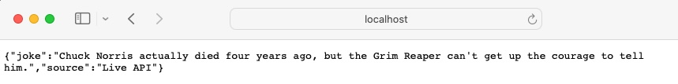
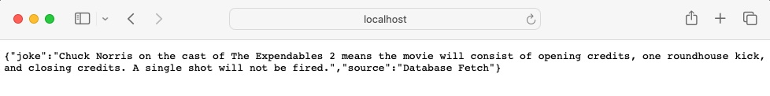

### Simple Web Request Service in Go Lang
#### Author: Matt Martin
#### Last Updated: 5/12/24

---
### Overview

You ever wonder when you write a data pipeline that pings a REST api service how it all works? Like fetching tracking info for a UPS package or getting weather information for a particular zip code? What's on the other end that receives your URL and sends back the payload? How does it "JSONify" it? How is it always on and ready to serve?

Well if you are interested, then keep reading this article. It provides a simple demonstration of making a RESTful API service that can receive a few different URL paths (known as routes) and serve back a response. And for fun, we will be serving back Chuck Norris jokes :smiley:

--- 
### Creating the Rest API Service

Creating a Rest API service in Go is pretty straight forward. You can use Go's `net/http` package as seen below. In the example, we are creating 3 different routes:

1. The Default path (localhost:8080/)
2. Joke Path to live API hit (localhost:8080/getjokeapi)
3. Joke Path to postgres DB (localhost:8080/getjokedb)

Once those routes are established, we simply launch the server and listen e.g. `http.ListenAndServe`.

```Go
package app

import (
	"encoding/json"
	"fmt"
	"net/http"
)

type Message struct {
	Joke   string `json:"joke"`
	Source string `json:"source"`
}

func LaunchRestServer() {

	http.HandleFunc("/", func(w http.ResponseWriter, r *http.Request) {
		handleHome(w, r)
	})

	http.HandleFunc("/getjokeapi", func(w http.ResponseWriter, r *http.Request) {
		handleJokeApi(w, r)
	})

	http.HandleFunc("/getjokedb", func(w http.ResponseWriter, r *http.Request) {
		handleJokeDb(w, r)
	})

	port := ":8080"

	fmt.Printf("Starting server on %s\n", port)
	http.ListenAndServe(port, nil)
}

```

You will notice inside each handle function, we have a specific sub function we are calling. That sub function is what will actually display back the JSON to the client on the webpage. Below are the sub functions assigned to each handler.

```GO
func handleJokeApi(w http.ResponseWriter, r *http.Request) {

	j, err := GetCnJokeApi()
	if err != nil {
		err_msg := fmt.Sprintf("Failed to fetch joke from API: %v", err)
		http.Error(w, err_msg, http.StatusInternalServerError)
		return
	}

	message := Message{
		Joke:   j,
		Source: "Live API",
	}
	w.Header().Set("Content-Type", "application/json")
	json.NewEncoder(w).Encode(message)

}

func handleJokeDb(w http.ResponseWriter, r *http.Request) {

	j, err := GetCnJokeDb()
	if err != nil {
		err_msg := fmt.Sprintf("Failed to fetch joke from Database: %v", err)
		http.Error(w, err_msg, http.StatusInternalServerError)
		return
	}

	message := Message{
		Joke:   j,
		Source: "Database Fetch",
	}
	w.Header().Set("Content-Type", "application/json")
	json.NewEncoder(w).Encode(message)

}

// default
func handleHome(w http.ResponseWriter, r *http.Request) {
	message := Message{
		Joke: "Not a joke here; Demo Go Lang Web Request Server",
	}

	w.Header().Set("Content-Type", "application/json")
	json.NewEncoder(w).Encode(message)
}
```

For the API and DB functions, you will notice that each calls a separate function to actually retrieve the joke text, either from a live API call or a database. The default path just serves up a standard message and does not do any sub calls.

---
### Fetching the data from an API
Alright, so now that our routes are setup, let's take a look at the actual code that gets the joke text and sends it back to the handlers. Below is the code that does a live api call to the public free Chuck Norris API:

```GO
package app

import (
	"encoding/json"
	"fmt"
	"net/http"
)

func GetCnJokeApi() (joke string, err error) {
	url := "https://api.chucknorris.io/jokes/random"
	resp, err := http.Get(url)
	if err != nil {
		return "", fmt.Errorf("error making GET request: %v", err)
	}
	defer resp.Body.Close()

	var j struct {
		Joke string `json:"value"`
	}
	if err := json.NewDecoder(resp.Body).Decode(&j); err != nil {
		return "", fmt.Errorf("error parsing JSON: %v", err)
	}
	return j.Joke, nil
}


```

This function does a simple web request call to the Chuck Norris joke's free api and grabs the joke text and sends it back to the user.


---
### Fetching the data from Postgres

Ok, so how do we instead have a route call a Postgres database to fetch the joke? Here's the code for that one:

- Side note: I used homebrew to install postgres on my laptop. It was pretty straight forward.

```GO
package app

import (
	"database/sql"

	_ "github.com/lib/pq"
)

//go get github.com/lib/pq

func GetCnJokeDb() (joke string, err error) {
	db, err := sql.Open("postgres", "postgresql://localhost/testdb1?sslmode=disable")
	if err != nil {
		return
	}

	defer db.Close()

	err = db.QueryRow("SELECT joke_txt FROM test_sch1.cn_jokes ORDER BY RANDOM() LIMIT 1").Scan(&joke)
	if err != nil {
		return
	}

	return
}

```
This code queries a random joke from our Postgres joke table and sends the text back. The `QueryRow` function is nice in that it's meant to query a single row and we can bootstrap the result to our local variable in one shot.

---
### Wiring It All Up

Now that I've shown you the meat and potatoes of this this code base, how do we wire it all up so we can easily launch it? The final program is organized into this folder tree structure:

```bash
rest_service - top level folder for program
├── app
│   ├── common.go
│   ├── jokeapi.go
│   ├── jokedb.go
│   └── restserver.go
├── go.mod
├── go.sum
├── main.go - entry/launcher for program
└── readme.md
```

To launch it, in terminal, we simply run `go run main.go` and Voila! Once the program is up and running, you shouls see this in terminal:


At this point, we can test our various endpoints. Here is what it looks like for the live API route in Safari using URL `http://localhost:8080/getjokeapi`:



And here is what it looks like when we call our Postgres DB endpoint URL `localhost:8080/getjokedb`:




And that's how a rest server serves information back to the user!

---
### Conclusion

This article demonstrated a simple overview of how to create a RESTful service using Go lang. There are projects out there that are a lot more thorough and involved like [this one](https://github.com/learning-cloud-native-go/myapp), but if you don't need all the bells and whistles and just need something simple to serve up, the code in this article should suffice. But you might be asking "How can I actually deploy this code in the cloud?" There are many options. The easiest one I know is to package this up into docker container and send it up the [AWS Elastic Beanstalk](https://aws.amazon.com/elasticbeanstalk). You can also create AWS Lambda endpoints, or if you really want control, you can put it on EC2. And those are just a few of the options out there. All the big 3 cloud providers support a multitude of ways to deploy RESTFul servers/applications. 

Thanks for reading - Matt
