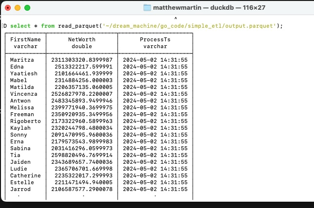

### Using Go Lang to do some simple ETL
#### Author: Matt Martin
#### Date; 5/1/24

<hr>
<h3>Overview</h3>
A well respected DE recently mentioned, Rust has won the DE war against Go. Rust has better code safety in place, is faster, and has a well supported dataframe library known as Polars. Go has some dataframe libraries floating around the interwebs, but they have not been maintained in over 2 or 3 years, which makes me think they are dead. If you are curious, you can google "Go Dataframe" and see for yourself. With that said though, I wanted to grease the wheels and see if we could use Go for some light weight ETL. Read on if you like to learn more.

<hr>
<h3>The Setup</h3>
For this process, we will generate a fake dataset using a previous go project i worked on found at this link: https://github.com/mattmartin14/dream_machine/tree/main/go_code/fake_data. After that, the code in this program will do the following:

1. Read in the CSV dataset that we generated
2. Group on one column and sum on another
3. Add a process timestamp to the output
4. Write out the results to both parquet and CSV

<hr>
<h3>And Here We Goooooooo</h3>

To generate the initial fake dataset, I ran this command: 

```bash
./fd create --filetype csv --maxworkers 6 --prefix fin_data_ --outputdir ~/test_dummy_data/fd --files 1 --rows 10000000
```

Boom, now we have a 10M row CSV file. Next, let's read the data. To do this, its not that hard. Go has a built-in CSV package. Code looks like this:

```go
file, err := os.Open(f_path)
if err != nil {
    fmt.Println("Error:", err)
    return
}
defer file.Close()

reader := csv.NewReader(file)

data, err := reader.ReadAll()
if err != nil {
    fmt.Println("Error:", err)
    return
}
```

So far so good. Now, we need to build what Go calls a "Map" to store our aggregated results, which is a key/value pair list. Here's that code:

```go
tsfmData := make(map[string]float64)
```

Now let's read through the CSV and group by "FirstName" column and sum the "NetWorth" column. A previous part of the code goes and finds those fields in the raw CSV. If you are curiuos, you can look [here](./app/helpers.go) on how that's done:

```go

for i, record := range data {

    // Skip the header row if it exists
    if hasHeader && i == 0 {
        continue
    }

    groupingValue := record[groupingColIndex]
    summingValueStr := record[summingColIndex]

    summingValue, err := strconv.ParseFloat(summingValueStr, 64)
    if err != nil {
        fmt.Println("Error parsing summing value:", err)
        continue
    }

    tsfmData[groupingValue] += summingValue
}
```

Finally, let's output both results to a CSV file and a Parquet file. For this, I'm just providing a link to the code files, since its a little more involved. Each file also tacks onto the dataset a process timestamp as part of our ETL requirements:

1. [CSV Writer](./app/csvWriter.go)
2. [Parquet Writer](./app/parquetWriter.go)

I was pleasantly surprised that Go has a pretty easy-to-use parquet file package that can be found [here](https://github.com/xitongsys/parquet-go/tree/master). The project was last updated 8 months ago, so I would not call it dead yet.

<hr>
<h3>Validating the ETL</h3>
Testing the code...hey, that's what ChatGPT is for right? Given I'm using a parquet library that I've never heard of before, how do I validate that the actual parquet file was written out correctly and readable by other systems? Quack Quack Quack...DuckDB to the rescue. I ran this DuckDB command in terminal to check the parquet file:

```bash
select * from read_parquet('~/dream_machine/go_code/simple_etl/output.parquet');
```

And Voila
<h4></h4>


<hr>
<h3>Conclusion</h3>
The Go code ran in debug mode was able to plow through a 10M row csv file in about 5 seconds, which is pretty darn fast. As a built binary, it ran under 4 seconds. Overall, I'm impressed with its ability to read and write data to multiple file formats. Would this be ideal though for data engineering if you had access to Polars or Spark? Probably not since those can acccomplish what I did in just a few lines of code with those dataframe packages. But nonetheless, it worked!

<hr>
<h3>Other Thoughts</h3>
I could probably improve on this code to where the column names are fed dynamically to the various writing modules. Additionally, I'd be curious how much of an exercise it would be to update the code to group on 2 columns instead of just 1. One final thought is how hard it would be to add things like distinct counts. In my head, I think the only way to do this is that I'd have to build another map tracking table and as I'm reading the raw source CSV, add the value if it doesn't exist in the map table. Then at the end, get the length/count of that map tracking table. Here's the full code link [Go Attempt at ETL](./main.go).


