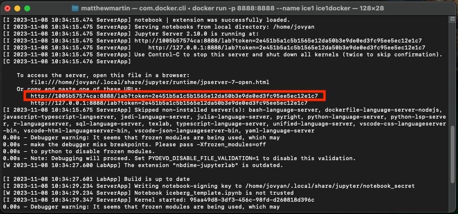
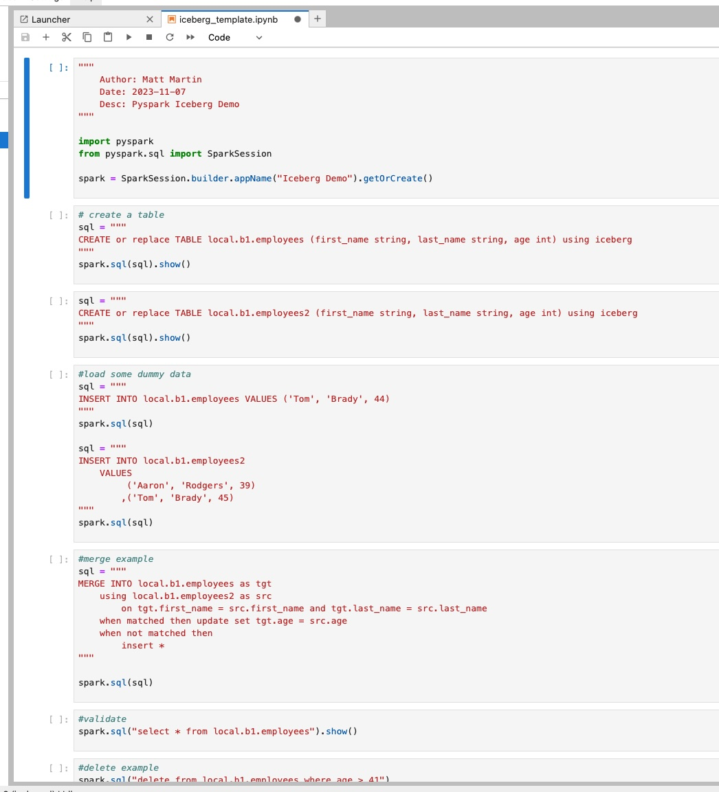

### Using Docker with Iceberg

<h5>Author: Matt Martin</h5>
<h5>Date: 2023-11-06</h5>
<h5>Last Modified: 2023-11-11</h5>

<h4>Overview</h4>
Iceberg is a great platform for running ANSI SQL statements against open source files. Instead of having to load your data into a database, you can just store the files in an object store. This makes portability easy between cloud platforms. To get Iceberg to work though, you have to be very specific on the versions of spark and java that you have installed on your machine; otherwise, you will get very obscure and bizarre runtime errors. The easiest way to make this process repeatable is by leveraging a docker file, like the one in this repo.
<hr></hr>
<h5>Install Steps</h5>
The docker file pulls in the correct versions of spark and other dependencies to where we can in one container launch a python notebook that has all the requirements we need. To do this, follow these steps:
<h5><h5>
1. Fork this repo to your local workstation (you will need more than just the docker file as the docker file copies and uses a few other files in this repo to finalize)
2. Build the image on the docker file using docker desktop or the vs code docker plugin
3. Start the container using this bash command below that references the image:

- Note: This bash command assumes your docker file is in a folder called "iceberg4". If you put it in a different folder, you will need to adjust the command below accordingly

```bash
docker run -p 8888:8888 --name ice1 iceberg4
```

4. When you start the container, you will see several outputs on the terminal screen. One is a URL to the jupyter server which is about halfway down tas seen in the screenshot below. Grab that URL and paste it into a web broswer and launch it.



6. You should now see the Juypter lab server in the web browser. There is a template notebook that contains sample Iceberg spark code to get you started called "iceberg_template.ipynb". Open that up and you should see the following:




<h4>Matt's Side Notes</h4>

1. The biggest gotcha while trying to get Iceberg to work was dealing with errors on the iceberg runtime and extensions incompatability. You need to make sure that the versions of the iceberg spark runtime and iceberg spark sql extensions are identical. 

2. My test environment is on python 3.11 and pyspark 3.5. I have not tested this for backwards compatability on other versions.