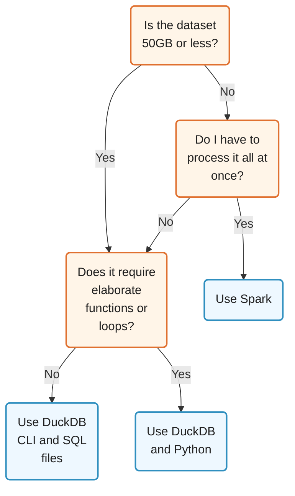

# ETL Tool Selection Decision Tree

```mermaid
%%{init: {
	'look': 'handDrawn',
  'theme': 'base',
	'themeVariables': {
		'fontFamily': '"Bradley Hand", cursive',
		'fontSize': '22px'
	},
	'themeCSS': '.nodeLabel, .edgeLabel { font-family: "Bradley Hand", cursive; font-size: 22px; } .edgeLabel rect { fill: transparent !important; stroke: none !important; }'
}}%%
flowchart TB
	A(Is the dataset<br/>50GB or less?)
	B(Do I have to<br/>process it all at<br/>once?)
	C(Does it require<br/>elaborate<br/>functions or<br/>loops?)
	D(Use Spark)
	E(Use DuckDB<br/>CLI and SQL<br/>files)
	F(Use DuckDB<br/>and Python)

	A -->|No| B
	A -->|Yes| C
	B -->|No| C
	B -->|Yes| D
	C -->|No| E
	C -->|Yes| F

	classDef decision fill:#fff5e8,stroke:#e0702f,stroke-width:2px,color:#1f1f1f;
	classDef outcome fill:#eef8ff,stroke:#2f8fbf,stroke-width:2px,color:#1f1f1f;

	class A,B,C decision;
	class D,E,F outcome;
```
