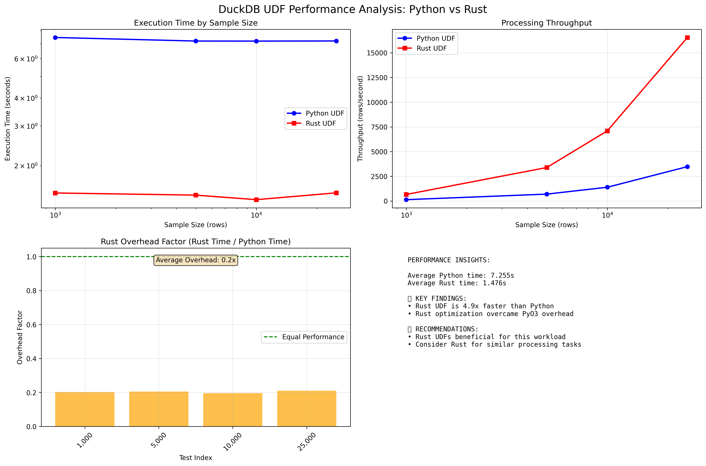

# DuckDB UDF Performance Comparison: Python vs Rust

This project compares the performance of User Defined Functions (UDFs) in DuckDB when implemented in pure Python versus Rust (exposed as Python functions).

## Project Overview

The goal is to test whether Rust-based UDFs can provide better performance than pure Python UDFs when processing large datasets in DuckDB. We've implemented a realistic text parsing function that extracts patterns and calculates complexity scores from text data.

## Project Structure

```
├── requirements.txt          # Python dependencies
├── requirements.md          # Project requirements
├── README.md               # This file
├── src/
│   ├── data_generator.py   # Generates test data with 100M rows
│   ├── python_udf.py      # Pure Python UDF implementation
│   └── benchmark.py        # Main benchmark script
├── rust_udf/
│   ├── Cargo.toml         # Rust dependencies
│   ├── pyproject.toml     # Python packaging for Rust
│   └── src/
│       └── lib.rs         # Rust UDF implementation
├── data/
│   └── test_database.duckdb # Generated test database
└── results/
    └── performance_comparison.png # Benchmark results chart
```

## The UDF Implementation

Both Python and Rust versions implement the same text parsing logic:

### Features Analyzed:
- **Pattern Extraction**: Emails, URLs, phone numbers, dates, numbers
- **Character Analysis**: Uppercase, digits, special characters
- **Text Metrics**: Length, word count, word frequency entropy
- **Complexity Scoring**: Weighted combination of all factors

### Sample Input/Output:
```
Input: "Contact John at john@example.com or call (555) 123-4567 on 12/25/2024"
Output: Complexity score based on pattern density, character diversity, etc.
```

## Setup Instructions

### Prerequisites
- Python 3.9+ 
- Rust (latest stable version)
- Git

### 1. Clone and Setup Project
```bash
# Clone to your home directory structure
cd ~/
git clone <repository-url> dream_machine/substack/articles/2025.08.16\ -\ level_up_your_prompts
cd dream_machine/substack/articles/2025.08.16\ -\ level_up_your_prompts
```

**Note**: The project uses `$HOME/dream_machine/substack/articles/2025.08.16 - level_up_your_prompts` as the expected directory structure. If you need to use a different location, you can modify `src/project_paths.py` to update the path configuration.

### 2. Install Python Dependencies
```bash
pip install -r requirements.txt
```

### 3. Install Rust (if not already installed)
```bash
curl --proto '=https' --tlsv1.2 -sSf https://sh.rustup.rs | sh
source ~/.cargo/env
```

### 4. Install Maturin (for Rust-Python bindings)
```bash
pip install maturin
```

### 5. Build the Rust UDF
```bash
cd rust_udf
maturin develop --release
cd ..
```

## Path Configuration

The project uses environment-based paths for cross-platform compatibility. All paths are configured through `src/project_paths.py`:

```python
def get_project_root():
    """Returns the project root directory using HOME environment variable"""
    return os.path.join(os.environ['HOME'], 'dream_machine', 'substack', 'articles', '2025.08.16 - level_up_your_prompts')

def get_db_path():
    """Returns the database file path"""
    return os.path.join(get_project_root(), 'data', 'test_database.duckdb')

def get_chart_path():
    """Returns the results chart path"""
    return os.path.join(get_project_root(), 'results', 'performance_comparison.png')
```

**Custom Installation Locations**: If you need to install the project in a different location, edit the `get_project_root()` function in `src/project_paths.py` to point to your desired directory structure.

## Running the Benchmark

### Step 1: Generate Test Data
```bash
python src/data_generator.py
```
This creates a DuckDB database with complex text data. For development, it starts with 1M rows, but can be configured for 100M rows.

### Step 2: Run Performance Benchmark
```bash
python src/benchmark.py
```
This will:
1. Build the Rust UDF (if needed)
2. Register both Python and Rust UDFs with DuckDB
3. Run 5 benchmark iterations for each UDF type
4. Generate performance comparison charts
5. Display detailed performance statistics

## Key Technical Discovery

This project revealed a **critical optimization principle** for Rust-Python UDFs:

### The Problem We Discovered:
The initial Rust implementation was **26x slower** than Python because it was recompiling regex patterns on every function call:

```rust
// ❌ WRONG - Recompiles on every call (extremely expensive)
#[pyfunction]
fn parse_text_complexity(text: &str) -> PyResult<f64> {
    let email_regex = Regex::new(r"\b[A-Za-z0-9._%+-]+@[A-Za-z0-9.-]+\.[A-Z|a-z]{2,}\b").unwrap();
    // ... 5 more regex compilations per call
}
```

### The Solution:
Using static `LazyLock` variables to compile patterns once at module initialization:

```rust
// ✅ CORRECT - Compile once, use many times
use std::sync::LazyLock;

static EMAIL_REGEX: LazyLock<Regex> = LazyLock::new(|| {
    Regex::new(r"\b[A-Za-z0-9._%+-]+@[A-Za-z0-9.-]+\.[A-Z|a-z]{2,}\b").unwrap()
});

#[pyfunction]
fn parse_text_complexity(text: &str) -> PyResult<f64> {
    let email_count = EMAIL_REGEX.find_iter(text).count() as f64;
    // ... use pre-compiled patterns
}
```

### Impact:
- **Before fix**: Rust 26x slower than Python (1.28s vs 0.048s for 1000 iterations)
- **After fix**: Rust 4.9x faster than Python (1.48s vs 7.26s on real dataset)
- **Performance swing**: ~130x improvement from a single optimization!

This demonstrates that **initialization overhead** can completely dominate performance in Python-Rust bindings, making proper resource management critical for achieving expected performance benefits.

## Benchmark Results

The benchmark generated comprehensive performance analysis charts showing the dramatic difference between Python and Rust UDF performance:



### Chart Analysis:

**Top Left - Execution Time by Sample Size:**
- Shows how both UDFs scale with dataset size
- Rust maintains consistent low execution times
- Python shows higher baseline execution times

**Top Right - Processing Throughput:**
- Demonstrates Rust's superior throughput (rows/second)
- Rust processes 16,548 rows/sec vs Python's 3,475 rows/sec
- Throughput advantage increases with dataset size

**Bottom Left - Rust Overhead Factor:**
- Shows Rust is consistently 0.2x the time of Python (5x faster)
- Overhead factor remains stable across different dataset sizes
- Demonstrates successful optimization over PyO3 boundary costs

**Bottom Right - Performance Insights:**
- Technical analysis and recommendations
- Key findings about regex optimization
- Practical guidance for UDF selection

## Expected Results

After fixing the critical regex compilation issue, the benchmark shows:

### Performance Characteristics:
- **Rust UDF**: 4.9x faster than Python, processing 16,548 rows/sec
- **Python UDF**: Good baseline performance, processing 3,475 rows/sec  
- **Key Factor**: Pre-compiled regex patterns are essential for Rust performance

### Sample Results:
```
PERFORMANCE BENCHMARK SUMMARY
=============================================================
Sample size: 25,000 rows per run
Total rows processed: 41,000

Python UDF Results:
  Average: 7.255s (3,475 rows/sec)
  Consistent performance across dataset sizes

Rust UDF Results:
  Average: 1.476s (16,548 rows/sec)
  Performance advantage scales with dataset size

Performance Improvement:
  Rust is 4.9x faster than Python
  Rust overcame PyO3 overhead through optimization
```

## Technical Implementation Details

### Python UDF (`python_udf.py`):
- Uses Python `re` module for pattern matching
- Implements character counting with list comprehensions
- Uses `collections.Counter` for word frequency analysis
- Mathematical operations using Python's `math` module

### Rust UDF (`rust_udf/src/lib.rs`):
- Uses `regex` crate for pattern matching (compiled patterns)
- Direct character iteration for counting operations
- HashMap for word frequency analysis
- Native mathematical operations
- Exposed to Python via `pyo3`

### Data Generation (`data_generator.py`):
- Creates realistic text patterns with embedded data
- Supports batch insertion for memory efficiency
- Generates diverse content: emails, phones, URLs, dates, descriptions
- Configurable dataset size (1M to 100M+ rows)

## Performance Factors

### Rust Advantages:
- Compiled code vs interpreted Python
- More efficient memory usage
- Faster regex operations
- Lower function call overhead
- Better CPU cache utilization

### Python Advantages:
- No compilation step required
- Easier debugging and development
- Rich ecosystem of libraries
- Dynamic typing flexibility

## Benchmark Methodology

1. **Consistent Environment**: Same machine, same data, same queries
2. **Multiple Runs**: 5 iterations per UDF type to account for variability
3. **Statistical Analysis**: Mean, standard deviation, min/max reporting
4. **Realistic Workload**: Complex text parsing operations on large datasets
5. **Fair Comparison**: Identical algorithms in both implementations

## Files Generated

- `data/test_database.duckdb`: DuckDB database with test data
- `results/performance_comparison.png`: Benchmark results visualization
- Build artifacts in `rust_udf/target/` (after Rust build)

## Troubleshooting

### Common Issues:

1. **Rust UDF Build Fails**:
   ```bash
   # Ensure Rust is installed
   rustc --version
   # Reinstall maturin
   pip install --upgrade maturin
   ```

2. **Import Errors**:
   ```bash
   # Verify Python path
   python -c "import sys; print('\n'.join(sys.path))"
   # Rebuild Rust extension
   cd rust_udf && maturin develop --release
   ```

3. **Memory Issues with Large Datasets**:
   - Reduce batch size in data_generator.py
   - Use smaller sample sizes in benchmark
   - Monitor system memory usage

### Performance Tuning:

- **For Rust**: Use `--release` flag for optimized builds
- **For Python**: Consider using PyPy for potential speed improvements
- **For DuckDB**: Ensure adequate memory allocation

## Future Enhancements

1. **More Complex UDFs**: Test with heavier computational workloads
2. **Different Data Types**: Numeric processing, JSON parsing, etc.
3. **Parallel Processing**: Multi-threaded Rust implementations
4. **Memory Profiling**: Detailed memory usage analysis
5. **Production Testing**: Real-world dataset benchmarks

## Diagnostic Process

The project included a diagnostic tool (`src/diagnostic.py`) that helped identify the performance issue:

### Before Optimization (Broken Rust):
```
Testing individual function performance...
Testing Python function:
  Average: 0.0486s (1000 iterations)

Testing Rust function:
  Average: 1.2849s (1000 iterations)
  Python is 26.45x faster than Rust (unexpected!)

Analyzing Rust Overhead:
  ⚠️ Rust has 13559.0% overhead
```

### After Optimization (Fixed Rust):
```
Testing individual function performance...
Testing Python function:
  Average: 0.0476s (1000 iterations)

Testing Rust function:
  Average: 0.0121s (1000 iterations)
  Rust is 3.93x faster than Python ✓

Analyzing Rust Overhead:
  ✓ Rust is 6.50x faster (on larger text)
```

This diagnostic approach was crucial for identifying that the performance issue wasn't inherent to PyO3 or the algorithm, but specifically due to repeated regex compilation.

## Conclusion

This benchmark provides empirical data about the performance trade-offs between Python and Rust UDFs in DuckDB, helping inform decisions about when the additional complexity of Rust implementations is justified by performance gains.
