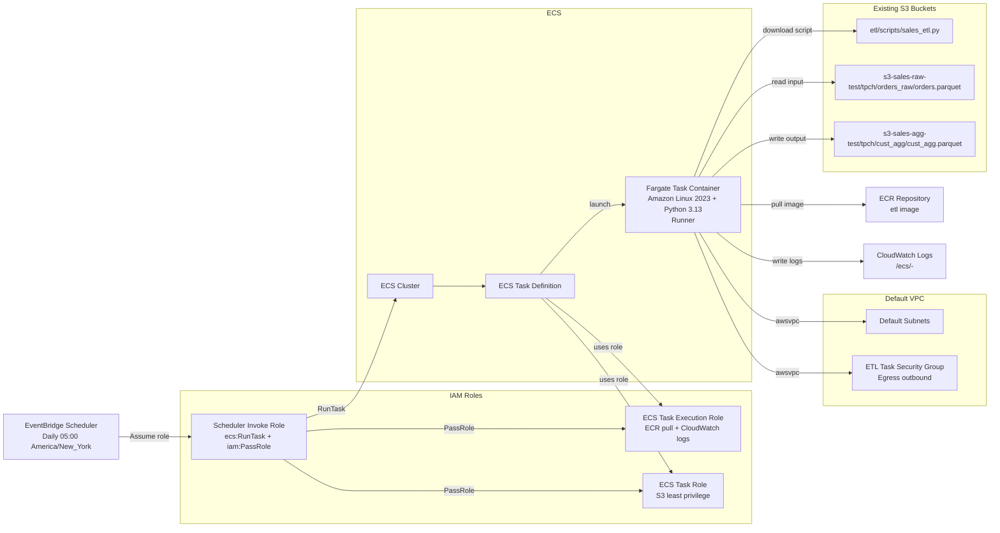

# ECS Fargate DuckDB ETL (End-to-End Demo)

This project shows how to build and schedule a Python ETL pipeline on AWS ECS Fargate from start to finish.
The container is Amazon Linux 2023 with Python 3.13 explicitly installed.
Python dependencies are pinned to DuckDB 1.5.2 and boto3 1.40.31.
Terraform uses a runtime environment pivot in `locals.tf` via `environment_rt = "test"`, so generated asset names include `test`.
Terraform also supports `app_name` for app-specific assets (ECS task definition, EventBridge schedule) while keeping runner assets (ECR repo, ECS cluster) reusable.

## Reuse and Promotion Model

This project is designed so you can scale to many ETL pipelines without rebuilding core runner infrastructure each time.

- Shared runner assets (reused across pipelines):
  - ECS cluster
  - ECR runner image
- App-specific assets (names include `app_name`):
  - ECS task definition family
  - EventBridge schedule

Environment promotion pivot:

- `locals.tf` contains `environment_rt = "test"`.
- Changing that to `"prod"` creates a new class of named assets for prod while preserving the reusable runner model.
- Typical pattern: keep one runner image/cluster, vary `environment_rt` and `app_name` to isolate pipelines by environment and app.

## What It Builds

- A reusable Python ETL runner container based on Amazon Linux 2023
- A runtime ETL script artifact stored in S3 at `etl/scripts/` and fetched on task start
- DuckDB ETL logic that reads and writes Parquet in S3
- DuckDB `httpfs` and `aws` extensions pre-installed into the image for no-internet runtime execution
- ECR repository for the image
- ECS cluster and Fargate task definition
- EventBridge Scheduler job running daily at 05:00 America/New_York
- IAM roles with least-privilege separation:
  - ECS task execution role (pull image, write logs)
  - ECS task role (only required S3 permissions)
  - Scheduler role (only run this task, pass only these roles)

## AWS Topology



## Project Layout

- `app/runner.py`: container entrypoint that downloads and executes ETL script from S3
- `scripts/sales_etl.py`: canonical ETL script for local runs and ECS runtime upload
- `helpers/`: shared Python helper library (copied into container as `/app/helpers`)
- `docker/Dockerfile`: Amazon Linux 2023 image with Python + dependencies
- `terraform/`: all infrastructure resources

## Prerequisites

- AWS credentials configured locally (your existing IAM user is fine)
- Docker installed and running
- Terraform >= 1.5
- AWS CLI >= 2

## Local Run (Docker-like Python Path)

Use this wrapper to run the ETL locally with `PYTHONPATH` including project root, matching container behavior:

```bash
./scripts/run_sales_etl_local.sh
```

## ETL Contract

The ETL task (sales_etl.py) reads from:

- `s3://s3-sales-raw-test/tpch/orders_raw/orders.parquet`

It writes to:

- `s3://s3-sales-agg-test/tpch/cust_agg/cust_agg.parquet`

Required task environment variables are provided by Terraform:

- `S3_SCRIPT_BUCKET`
- `S3_SCRIPT_KEY`
- `AWS_REGION`
- `LOG_LEVEL`

Optional notification secret:

- `SLACK_WEBHOOK_SECRET_NAME` (default: `slack_webhook_test`)

Terraform does not create or modify source/target buckets in this setup.

## Secure Slack Webhook Setup

Do not put webhook URLs in `docker/Dockerfile`, Terraform files, or git-tracked source.
The secure pattern is to store the webhook in AWS Secrets Manager and let the ETL app retrieve it at runtime.

1. Create or update the secret in AWS Secrets Manager:

```bash
aws secretsmanager create-secret \
  --name "slack_webhook_test" \
  --secret-string "https://hooks.slack.com/services/XXX/YYY/ZZZ"

# If the secret already exists:
aws secretsmanager put-secret-value \
  --secret-id "slack_webhook_test" \
  --secret-string "https://hooks.slack.com/services/XXX/YYY/ZZZ"
```

2. Set this in `terraform/terraform.tfvars`:

```hcl
slack_webhook_secret_name = "slack_webhook_test"
```

3. Apply Terraform so ECS task definition is updated:

```bash
terraform -chdir=terraform apply
```

After deployment, the ETL code reads `SLACK_WEBHOOK_SECRET_NAME` and fetches the webhook URL from Secrets Manager at runtime.

## Deploy: Step by Step

### 1. Initialize Terraform

```bash
cd terraform
cp terraform.tfvars.example terraform.tfvars
terraform init
terraform plan
terraform apply
```

Capture output values:

- `ecr_repository_url`
- `s3_source_bucket_name`
- `s3_target_bucket_name`
- `s3_script_bucket_name`

### 2. Build and Push Container Image

From project root:

```bash
./docker/build_and_push.sh
```

Use a custom tag:

```bash
./docker/build_and_push.sh v1.2.3
```

Force a clean rebuild:

```bash
./docker/build_and_push.sh latest --no-cache
```

The script automatically:

- Resolves `ECR_REPO_URL` from Terraform output (`ecr_repository_url`) unless explicitly provided
- Resolves `AWS_REGION` from environment, then `terraform/terraform.tfvars`, then defaults to `us-east-1`
- Logs in to ECR, builds from `docker/Dockerfile`, tags, and pushes

Optional manual fallback:

```bash
AWS_REGION=us-east-1
ACCOUNT_ID=$(aws sts get-caller-identity --query Account --output text)
ECR_REPO_URL=$(terraform -chdir=terraform output -raw ecr_repository_url)

aws ecr get-login-password --region "$AWS_REGION" \
  | docker login --username AWS --password-stdin "$ACCOUNT_ID.dkr.ecr.$AWS_REGION.amazonaws.com"

docker build -f docker/Dockerfile -t etl:latest .
docker tag etl:latest "$ECR_REPO_URL:latest"
docker push "$ECR_REPO_URL:latest"
```

If you push a non-latest tag, update `image_tag` in `terraform.tfvars` and apply again.

Quick local rebuild helper:

```bash
./docker/build_local.sh
./docker/build_local.sh etl:latest --no-cache
```

### 3. Upload ETL Script to S3

Terraform uploads `scripts/sales_etl.py` to `s3://<s3_script_bucket_name>/<s3_script_key>` as part of `terraform apply`.

If you change `scripts/sales_etl.py`, rerun `terraform apply` and Terraform will update the uploaded object.

If you use a different key, set `s3_script_key` in `terraform.tfvars` and apply again.

### 4. Seed Input Data in S3

Ensure this input exists in the source bucket:

- `s3://s3-sales-raw-test/tpch/orders_raw/orders.parquet`

### 5. Run a Manual Smoke Test (One-Off)

```bash
CLUSTER_ARN=$(terraform -chdir=terraform output -raw ecs_cluster_arn)
TASK_DEF_ARN=$(terraform -chdir=terraform output -raw ecs_task_definition_arn)
SUBNET_IDS=$(aws ec2 describe-subnets --filters Name=default-for-az,Values=true --query 'Subnets[].SubnetId' --output text)
SG_ID=$(aws ec2 describe-security-groups --filters Name=group-name,Values=*ecs-duckdb-etl-test-sg* --query 'SecurityGroups[0].GroupId' --output text)

aws ecs run-task \
  --launch-type FARGATE \
  --cluster "$CLUSTER_ARN" \
  --task-definition "$TASK_DEF_ARN" \
  --network-configuration "awsvpcConfiguration={subnets=[$(echo $SUBNET_IDS | sed 's/ /,/g')],securityGroups=[$SG_ID],assignPublicIp=ENABLED}"
```

### 6. Validate Results

- Check CloudWatch log group `/ecs/<project>-<env>`
- Check output objects in `s3://s3-sales-agg-test/tpch/cust_agg/`
- Confirm scheduler exists and next run time:

```bash
aws scheduler get-schedule --name ecs-duckdb-etl-test-main-etl-daily
```

## Least-Privilege IAM Notes

- Task role can read the configured script key, list/read source input prefix, and read/write/delete output objects in target prefix.
- Scheduler role can only call `ecs:RunTask` for this task and pass the two ECS roles.
- Execution role uses the AWS managed ECS execution policy.

## Common Adjustments

- Change schedule in `terraform.tfvars`:
  - `schedule_expression`
  - `schedule_timezone`
- Change ETL capacity:
  - `container_cpu`
  - `container_memory`
- Set external bucket names:
  - `s3_source_bucket_name`
  - `s3_target_bucket_name`
  - `s3_script_bucket_name`
- Change app-specific naming:
  - `app_name`
- Change script path:
  - `s3_script_key`

## CPU and Memory Sizing

Terraform uses AWS Fargate units:

- `container_cpu` is CPU units (`1024 = 1 vCPU`).
- `container_memory` is MiB (`1024 = 1 GiB`).

Quick sizing examples:

- Small ETL script: `container_cpu = 1024`, `container_memory = 4096`
- Medium ETL script: `container_cpu = 2048`, `container_memory = 8192`
- Heavy ETL script: `container_cpu = 4096`, `container_memory = 16384`

For your example of "about 8 GB RAM and a couple cores", use:

- `container_cpu = 2048`
- `container_memory = 8192`

## Cleanup

```bash
terraform -chdir=terraform destroy
```

No S3 bucket cleanup is required from this Terraform project because buckets are external.
