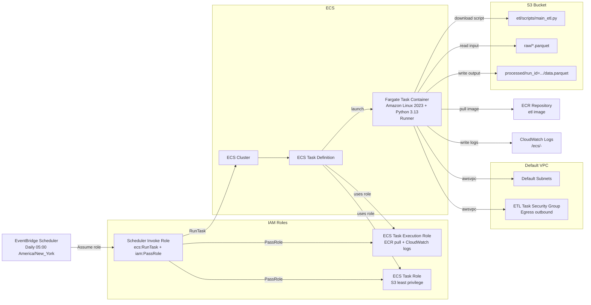

# ECS Fargate DuckDB ETL (End-to-End Demo)

This project shows how to build and schedule a Python ETL pipeline on AWS ECS Fargate from start to finish.
The container is Amazon Linux 2023 with Python 3.13 explicitly installed.
Python dependencies are pinned to DuckDB 1.5.2 and boto3 1.40.31.

## What It Builds

- A reusable Python ETL runner container based on Amazon Linux 2023
- A runtime ETL script artifact stored in S3 at `etl/scripts/` and fetched on task start
- DuckDB ETL logic that reads and writes Parquet in S3
- DuckDB `httpfs` and `aws` extensions pre-installed into the image for no-internet runtime execution
- ECR repository for the image
- ECS cluster and Fargate task definition
- EventBridge Scheduler job running daily at 05:00 America/New_York
- IAM roles with least-privilege separation:
  - ECS task execution role (pull image, write logs)
  - ECS task role (only required S3 permissions)
  - Scheduler role (only run this task, pass only these roles)

## AWS Topology



## Project Layout

- `app/runner.py`: container entrypoint that downloads and executes ETL script from S3
- `scripts/main_etl.py`: ETL script artifact to upload to `s3://<bucket>/etl/scripts/main_etl.py`
- `helpers/`: shared Python helper library (copied into container as `/app/helpers`)
- `docker/Dockerfile`: Amazon Linux 2023 image with Python + dependencies
- `terraform/`: all infrastructure resources

## Prerequisites

- AWS credentials configured locally (your existing IAM user is fine)
- Docker installed and running
- Terraform >= 1.5
- AWS CLI >= 2

## ETL Contract

The ETL task reads from:

- `s3://<bucket>/<S3_INPUT_PREFIX>*.parquet`

It writes to:

- `s3://<bucket>/<S3_OUTPUT_PREFIX>run_id=<timestamp>/data.parquet`

Required task environment variables are provided by Terraform:

- `S3_BUCKET`
- `S3_SCRIPT_KEY`
- `S3_INPUT_PREFIX`
- `S3_OUTPUT_PREFIX`
- `AWS_REGION`
- `LOG_LEVEL`

## Deploy: Step by Step

### 1. Initialize Terraform

```bash
cd terraform
cp terraform.tfvars.example terraform.tfvars
terraform init
terraform plan
terraform apply
```

Capture output values:

- `ecr_repository_url`
- `s3_bucket_name`

### 2. Build and Push Container Image

From project root:

```bash
AWS_REGION=us-east-1
ACCOUNT_ID=$(aws sts get-caller-identity --query Account --output text)
ECR_REPO_URL=$(terraform -chdir=terraform output -raw ecr_repository_url)

aws ecr get-login-password --region "$AWS_REGION" \
  | docker login --username AWS --password-stdin "$ACCOUNT_ID.dkr.ecr.$AWS_REGION.amazonaws.com"

docker build -f docker/Dockerfile -t etl:latest .
docker tag etl:latest "$ECR_REPO_URL:latest"
docker push "$ECR_REPO_URL:latest"
```

If you push a non-latest tag, update `image_tag` in `terraform.tfvars` and apply again.

### 3. Upload ETL Script to S3

Upload the runtime ETL script artifact:

```bash
BUCKET=$(terraform -chdir=terraform output -raw s3_bucket_name)
aws s3 cp ./scripts/main_etl.py "s3://$BUCKET/etl/scripts/main_etl.py"
```

If you use a different key, set `s3_script_key` in `terraform.tfvars` and apply again.

### 4. Seed Input Data in S3

You need at least one Parquet file in the input prefix:

```bash
BUCKET=$(terraform -chdir=terraform output -raw s3_bucket_name)
aws s3 cp ./sample-input.parquet "s3://$BUCKET/raw/sample-input.parquet"
```

### 5. Run a Manual Smoke Test (One-Off)

```bash
CLUSTER_ARN=$(terraform -chdir=terraform output -raw ecs_cluster_arn)
TASK_DEF_ARN=$(terraform -chdir=terraform output -raw ecs_task_definition_arn)
SUBNET_IDS=$(aws ec2 describe-subnets --filters Name=default-for-az,Values=true --query 'Subnets[].SubnetId' --output text)
SG_ID=$(aws ec2 describe-security-groups --filters Name=group-name,Values=*ecs-duckdb-etl-demo-sg* --query 'SecurityGroups[0].GroupId' --output text)

aws ecs run-task \
  --launch-type FARGATE \
  --cluster "$CLUSTER_ARN" \
  --task-definition "$TASK_DEF_ARN" \
  --network-configuration "awsvpcConfiguration={subnets=[$(echo $SUBNET_IDS | sed 's/ /,/g')],securityGroups=[$SG_ID],assignPublicIp=ENABLED}"
```

### 6. Validate Results

- Check CloudWatch log group `/ecs/<project>-<env>`
- Check output objects in `s3://<bucket>/processed/`
- Confirm scheduler exists and next run time:

```bash
aws scheduler get-schedule --name ecs-duckdb-etl-demo-daily
```

## Least-Privilege IAM Notes

- Task role can only read the configured script key, list/read from input prefix, and write to output prefix.
- Scheduler role can only call `ecs:RunTask` for this task and pass the two ECS roles.
- Execution role uses the AWS managed ECS execution policy.

## Common Adjustments

- Change schedule in `terraform.tfvars`:
  - `schedule_expression`
  - `schedule_timezone`
- Change ETL capacity:
  - `container_cpu`
  - `container_memory`
- Use a fixed bucket name:
  - `s3_bucket_name`
- Change script path:
  - `s3_script_key`

## Cleanup

```bash
terraform -chdir=terraform destroy
```

If S3 bucket is not empty, remove objects first:

```bash
BUCKET=$(terraform -chdir=terraform output -raw s3_bucket_name)
aws s3 rm "s3://$BUCKET" --recursive
terraform -chdir=terraform destroy
```
